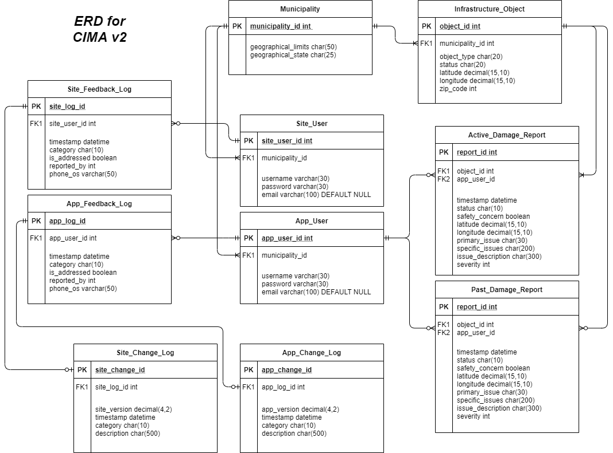
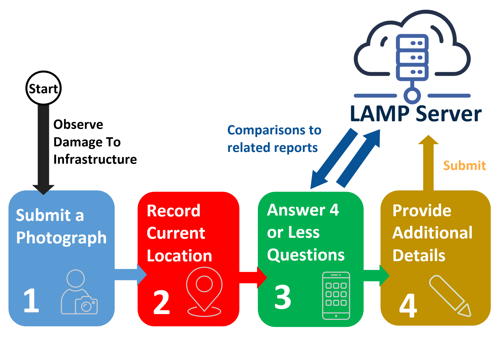

# Development Manual - CIMA
https://www.cimapp.org

This is the full user guide to Civil Infrastructure Management System (CIMA). It outlines the details of the software development and usage.

------------------------------------------------------------------
## Authors 
- **Harrison Randolph** - *B.S. Civil Engineering, Marshall University*  
&nbsp;&nbsp;&nbsp;&nbsp; Email: *randolph69@live.marshall.edu* 

- **Dr. James Bryce** - *Ph.D. Civil Engineering, Virginia Tech*  
&nbsp;&nbsp;&nbsp;&nbsp; Email: *bryce@live.marshall.edu*  

- **Eric Shoemaker** - *B.S. Computer Science, Marshall University*  
&nbsp;&nbsp;&nbsp;&nbsp; Email: *shoemaker30@live.marshall.edu*  
&nbsp;&nbsp;&nbsp;&nbsp; Github: *shoemaker30*

------------------------------------------------------------------
## Table of Contents
1. Server Architecture
    1. Hosting Service
    2. Server Setup
2. Website Design
3. Database Architecture
    1. ERD and Design
    2. Stored Procedures
    3. Users
    4. API connections
4. Mobile Application
    1. Application Setup
    2. Infrastructure Damage Report
5. Additional Items
    1. Marshall University Case Study
    2. Greenville, SC, Deployment
    3. Naive-Bayers Classifier for Ambiguous Reports
    4. Raspberry Pi Testing Server
6. Acknowledgements

------------------------------------------------------------------
## Server Architecture 

### Hosting Service

The server is hosted as a VM on Digital Ocean. The account is owned by Dr. James Bryce, so contact him at bryce@marshall.edu for details. 

The domain *cimapp.org* was purchased from NameCheap, and the account is also owned by Dr. James Bryce. 

### Server Setup

The server is a VM running *Ubuntu-Server-20.04.3 LTS* as the OS. The initial server setup closely adheres to the official DigitalOcean guides.  

We began by adding user accounts and enabling the basic firewall:
https://www.digitalocean.com/community/tutorials/initial-server-setup-with-ubuntu-20-04

Then installed libraries:
```
sudo apt-get update
sudo apt update
sudo apt-get install git clang
sudo apt install apache2 mysql-server php libapache2-mod-php php-mysql 
```

Be sure to allow Apache traffic through the firewall:
```
sudo ufw allow 'Apche Full'
```

For help setting up Apache:
https://www.digitalocean.com/community/tutorials/how-to-install-linux-apache-mysql-php-lamp-stack-ubuntu-18-04

With Apache installed, navigate into the new www folder and create the project files. Ensure that the permissions are correct so that the public can access the website through Apache Virtual Host. 
```
sudo chown -R $USER:$USER /var/www/cimapp.org
sudo chmod -R 755 /var/www/cimapp.org
```

The working directory is */var/www/cimapp.org*, and it is a cloned repository of: https://github.com/shoemaker30/cimapp.org

-------------------------------------------------------------
## Database Architecture

### ERD and Design


### Stored Procedures

- **SelectUserInfo**: Selects some general info about the user for his/her homepage
- **LogIn**: Selects the role of the user to be used to check login credentials; will return empty set if the username/password combo is incorrect

### Users 

#### User Roles
1. **Administrator:** has all priviledges; given to web developers 
2. **Supervisor** has priviledges to use app and view report management software; given to government workers
3. **Reporter** has proviledges to app and to view own reports; given to general public

## API Connections

Developed as ExpressJS application. To set up, make sure that you have the newest NodeJS and npm installations on the server. Then, navigate into the project directory and create a new project. 
```
sudo npm init CimaAPI
```

Then install the necessary dependencies 
```
cd CimaAPI
sudo npm --save install multer express mysql2 cors nodemon body-parser forever 
sudo npm -global nodemon
```
-------------------------------------------------------------
## Mobile Application

### Application Setup

### The Initial Setup Process

Steps used to create the application on my machine (not the server):
1. Install NodeJs and npm 
2. Install Expo `npm install --global expo-cli`
3. Create new app (navigate into folder where you want to create the project first). `expo init bims-photos`
4. Navigate into project directory for future steps. `cd bims-photos`
5. Install all dependencies we need for the project 
    `expo install @react-navigation/native @react-navigation/native-stack @react-navigation/stack react-native-screens react-native-safe-area-context @ant-design/icons-react-native @expo/vector-icons expo-image-picker`
    
To Run the Application During Development:
    `expo start`


#### Structure/Design
Four folders were created after initializing the app:
1. *screens*: holds javascript for each screen in the application (log-in, home, etc.)
2. *components*: holds javascript for each tool created (taskbar, buttons, etc.)
3. *images*: holds images used within application

The entry point of the app is *App.js*, and React Navigation (Stack implementation) is used to manage the different screens users can visit. 
The files in *screens* folder are each one screen, and they contain all necessary implementation for that screen.
To understand the usage of React Navigation: https://reactnative.dev/docs/navigation

##### App.js
Entry point for the application holding the stack of screens. It also keeps track of which inspection the user is submitting photos for in *selected_inspection* state.

##### Initial Screen
This screen shows the user a loading circle as it runs the functions necessary to set up the application. Mainly, it checks if the app is connected to the internet or not. Later, this screen could be used to integrate user accounts. For example, it could check credentials while loading. 

##### Report Screen 
This screen allows users to complete an Infrastructure Damage Report. 

##### User Screen
Displays analytics specific to the user and allows options to see past reports submission receipts and to change account details.

##### Map Screen
Allows users to see nearby reports and hazards.


### Infrastructure Damage Report


### Helpful Links Referenced During Development
React Component Class Template: 
https://gist.github.com/jungchris/0be463b4895e79ce8dfc1f280f830861

## Additional Items

### Raspberry Pi Test Server

When learning about server architecture and ReactJS, I developed the application on a Raspberry Pi 4B and accessed it in the LAN with SSH. This is a great way to learn server communication without having to pay for a more powerful server or have the site public. You 

When setting up a Raspberry Pi, use the Raspberry Pi Imager to install Ubuntu 20.04.3 LTS:
https://www.raspberrypi.com/news/raspberry-pi-imager-imaging-utility/

Then server setup is the same from this point on as it was using a Digital Ocean VM.

*If having trouble with HDMI not showing on Raspberry Pi, edit usercfg.txt to:*
```
# Place "config.txt" changes (dtparam, dtoverlay, disable_overscan, etc.) in
# this file. Please refer to the README file for a description of the various
# configuration files on the boot partition.
hdmi_force_mode=1
hdmi_group:0=2
hdmi_mode:0=39
```
*or just use ssh.*


-------------------------------------------------------------
## Acknowledgements

(*Spring 2021*)
Marshall University NASA Space Grant Advisory Committee 

(*Summer 2021*)
Marshall University Research Corporation 
